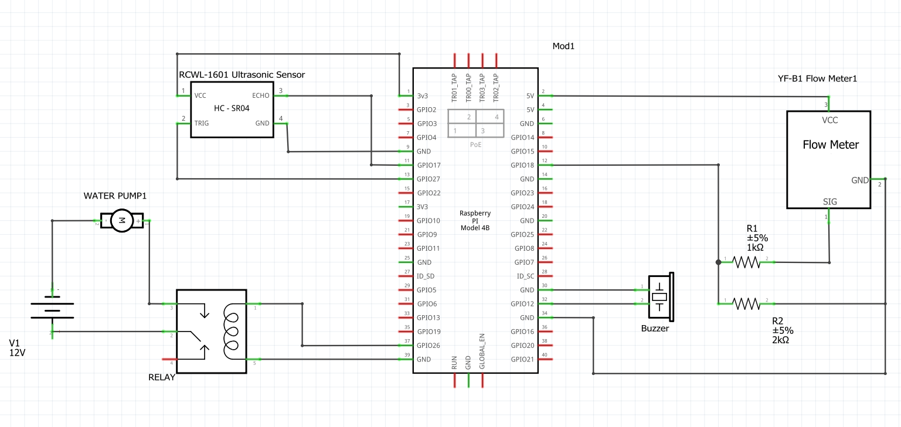
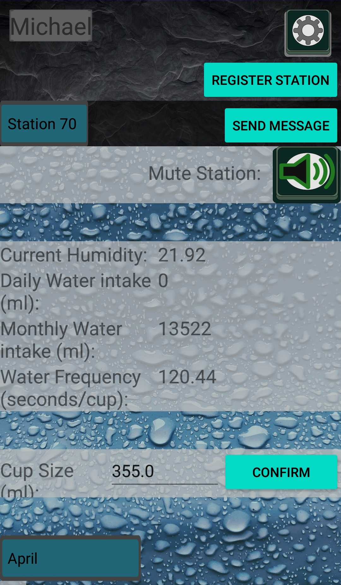

# SYSC 3010 - Term Project - The WaterBuddy
Group: L3_G7  
TA: Roger Selzer  
### Group Members
  - Michael Marsland - Computer Systems Engineering
  - Nick Milani - Computer Systems Engineering
  - Caleb Turcotte - Computer Systems Engineering

## The WaterBuddy

  

## Project Summary
The objective of The WaterBuddy is to promote a healthy, productive lifestyle by helping users stay on top of their hydration levels. The WaterBuddy automatically provides users with water and reminds them to drink based on a dynamic schedule that can be configured and tailored to each user. Finally, The WaterBuddy records the user’s daily water consumption metrics into a database for easy analysis and comparison.  
 
The WaterBuddy is a lightweight, affordable, and portable station connected to a widespread database that allows for scalability by including as many WaterBuddy stations as needed for every user of this product. The WaterBuddy station draws water it uses from a nearby water jug (the same as those found in common water coolers) but the WaterBuddy will allow for this just to be positioned on the ground out of the way of the common workstation unlike other desk mounted water coolers.   
 
The WaterBuddy System also comes with a companion Android Application taht allows users to adjust their settings as well as view their water data and send messages to their friend's WaterBuddy Stations. For users who do not have the full budget for a complete WaterBuddy system we have also created a WaterBuddy Minus which can be set-up with just a Raspberry Pi and SenseHat. This allows users to track their waterdata and keep in touch with their friends without requiring the full station with the fill system.

## Repository Structure
### [Smartphone Application](Application/WaterBuddy)
  - This folder contains the working project for the Water Buddy smart phone
  application, this application can be built inside Android Studio. Further
  information detailing this application is listed in the directories README file.

### [Main Application Code](Application/WaterBuddy/app/src/main/java/com/application/waterbuddy)
  - The main code for the smart phone application can be found here. This includes templates for reading data from the Firebase database, main activity logic for handling view changes, and a DatabaseInterface class that creates references to and updates Firebase database information.

### [Application Layout](Application\WaterBuddy\app\src\main\res\layout)
  - The main application layout can be found in the activity_main.xml file.
  Other xml files in this directory are for pop up windows that are featured in the application. Button designs can be found inside the res/drawables folder.

### [Application Tests](Application\WaterBuddy\app\src\test\java\com\application\waterbuddy)
  - JUnit tests are kept here, these tests are for testing the account creation
  and editing features and confirming that data is set correctly on the Firebase console.
 

### [WaterBuddy Station](WaterBuddy)
- This folder contains all of the code for The WaterBuddy station itself as well as the
WaterBuddy simulator (WaterBuddy Minus).

### [Simulators](WaterBuddy/Simulators/)
- The code required to mimic the WaterBuddy fill functionality and implement the buzzer
interface for the WaterBuddy Minus. This allows the station to be set up as a simulator
and run with just a Raspberry Pi and SenseHat.

### [Tests](WaterBuddy/Tests)
- All the tests for the WaterBuddy station are stored here. This includes all unit tests
for the hardware as well as the WaterBuddy software.

### [Weekly Updates](WeeklyUpdates)
- The groups weekly progress updates are maintained here for an overview of which team
member completed each part of the project and how we progressed over the term.

## Installation Instructions
### WaterBuddy Station
The WaterBuddy station requires the following hardware components:
  - Raspberry Pi 4B
  - SenseHat Module with long-pinned headers
  - RCWL-1601 Ultrasonic sensor
  - YF-B1 Flow sensor
  - Piezo buzzer
  - Submersible DC water pump
  - 5V Relay module
  - 12V DC power supply
  - 1x 1kOhm Resistor
  - 1x 2kOhm Resistor

Follow the schematic below to connect the hardware components to the RPi with the SenseHat and long-pinned header attached.

  

In order to set up the WaterBuddy station, clone this repository to your Raspberry Pi. Then in the file:
[waterbuddy.py](WaterBuddy/waterbuddy.py) you can edit line 261 to give your station an ID and set it as a physical station. \
    `water_buddy = WaterBuddy("[your-desired-station-ID-here]", simulator=False)`

You will be required to install python3 and the following python libraries:
  - pyrebase
        pip install Pyrebase

Finally, you can start the station by running waterbuddy.py
    python3 waterbuddy.py

### WaterBuddy Minus
In order to set up a WaterBuddy Simulator you will require a RaspberryPi with an attached
SenseHat Module. With just these components you can set-up a WaterBuddy Minus which allows
you to participate in the system without needing to buy all the additional fill-system hardware.

In order to set up the WaterBuddy Minus, clone this repository to your Raspberry Pi. Then in the file:
[waterbuddy.py](WaterBuddy/waterbuddy.py) you can edit line 261 to give your station an ID and set it as a simulator. \
    `water_buddy = WaterBuddy("[your-desired-station-ID-here]", simulator=True)`

You will be required to install python3 and the following python libraries:
  - pyrebase
        pip install Pyrebase

Finally, you can start the station by running waterbuddy.py
    python3 waterbuddy.py

## WaterBuddy Smart Phone application
The WaterBuddy application can be installed by using the pre-built [apk](Application/WaterBuddy/build/water_buddy.apk). Alternatively the application can be built inside Android Studio by downloading and opening the [Application/WaterBuddy](Application/WaterBuddy) project.

## Running Instructions / User Instructions (How to use the system/What they should see)
### WaterBuddy Station
On startup, the WaterBuddy station's display will scroll through a welcome message, accompanied by a tri-tone buzzer chime. After this, the WaterBuddy is ready to fill your cup. You can open up the smartphone app, create an account and register your station, and then set your cup size and lifestyle metrics. Once the cup size has been set, simply place your up in the WaterBuddy station and let it automatically fill your cup. The WaterBuddy will play different buzzer chimes and show messages on its display whenever a notification arrives. These notifications can be muted from within the app.

### WaterBuddy Minus
Once the WaterBuddy Minus system is installed and running you should see a welcome message.
You can then create an account on the app and register the station to yourself using
"[your-desired-station-ID-here]" established earlier. Once the station belongs to you, you
can use it in the same way as the main WaterBuddy station. The only difference is that you
will have to fill your water glass yourself and press the senseHat joystick in whenever you
finish your glass of water to allow the system to track your progress.

 

### WaterBuddy Smart Phone application
Once launched there is an option in the application to either log in to a current account or create a new user account. If you are a first time user then type in your desired username and password and select the "create new account" option.

After logging into your account you can edit your user settings such as height, weight, and thirst level by selecting the gear button in the top right of the application. This is also where a user can add friends to their account.

Stations can be registered by selecting the "register station" button and then entering your WaterBuddy stations id. The user can register as many stations as they own and can change their view by selecting the blue button on the top left of the application. The application connects to the firebase database and displays all relevant information about the selected WaterBuddy station, including current humidity, daily/weekly water intake, and the water frequency of the station. Once a station is registered you should see a view similar to the one below:

  

The cup size of your station can be edited in the "Cup Size" section and selecting "confirm". Editing this value will change how much water your WaterBuddy station dispenses so be careful to use the correct amount.

More details on the Water Buddy smart phone application can be found [here](Application/WaterBuddy).

 

## REQUIREMENTS (Remove this once done...)
Some required elements for your top-level Readme.md file:

  - Everything from one of your project report title pages (Group number, your names (no student ID here please), project title, project image, TA name, course code)
  - A summary of what the project is about (~200 words)
  - A description of your repo. What is the directory structure and what is (generally) in each top-level directory (test code, GUI, code for RPi1 that drives the car, etc)
  - Installation instructions (how could someone get your project up and running if they bought all the hardware?)
  - How to run your system (start this code on RPi1, then launch this code on the AWS server, then initialize...)
  - How someone will know that their installation is working correctly ("you should see...", or "running these tests should all pass", or...)
